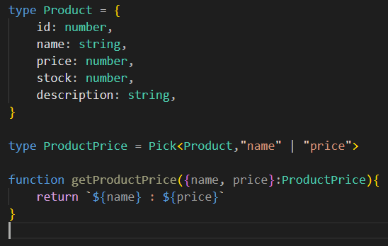
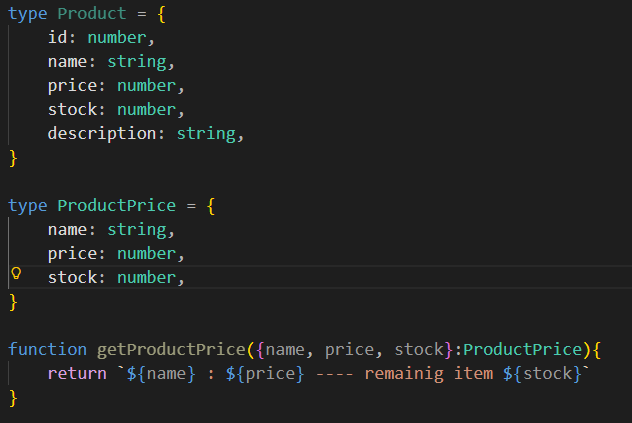

# Assignment-1 Apollo-1

## Problem 1

Create a TypeScript function *filterEvenNumbers* that accepts an array of numbers and returns a new array containing only the even numbers.

```typescript
function filterEvenNumbers(numbers: number[]): number[] {
    return numbers.filter((number) => number % 2 === 0);
}
```

## Problem 2

Create a TypeScript function *reverseString* that accepts a string and returns a new string with the characters in reverse order.

```typescript
function reverseString(str: string): string {
    const result = str.split("").reverse().join("")
    return result
}
```

## Problem 3

Create a TypeScript function checkType that accepts a parameter of a union type (string or number) and returns a string indicating whether the parameter is a "String" or "Number".

```typescript
type StringOrNumber = string | number

function checkType(param: StringOrNumber): string {
    if (typeof param === "string") {
        return "String"
    } else if (typeof param === "number") {
        return "Number"
    } else {
        return ""
    }
}
```

## Problem 4

Create a generic TypeScript function getProperty that accepts an object and a key of that object, and returns the value of that key. The function should be type-safe.

```typescript
type User = { id: number, name: string, age: number }

function getProperty<X extends User>(obj: X, key: keyof User) {
    return obj[key]
}

```

## Problem 5

Define a TypeScript interface Book with properties: title, author, and publishedYear. Then, create a function toggleReadStatus that accepts a Book object and returns a new Book object with an added property isRead set to true.

```typescript
interface Book {
    title: string,
    author: string,
    publishedYear: number
}

function toggleReadStatus(book: Book) {
    return { ...book, isRead: true }
}
```

## Problem 6

Create a class Person and a class Student that extends Person. The Student class should have an additional property grade. Implement a method getDetails in Student that returns a string with the student's details.

```typescript
class Person {
    name: string;
    age: number;
    constructor(name: string, age: number) {
        this.name = name;
        this.age = age;
    }
}
class Student extends Person {
    grade: string;
    constructor(name: string, age: number, grade: string) {
        super(name, age)
        this.grade = grade;
    }
    getDetails() {
        return `Name: ${this.name}, Age: ${this.age}, Grade: ${this.grade}`
    }
}
```

## Problem 7

Create a function *getIntersection* that accepts two arrays of numbers and returns a new array containing only the elements that appear in both arrays.

```typescript
type NumberArray = number[]

function getIntersection(arr1: NumberArray, arr2: NumberArray): NumberArray {
    const newArray: NumberArray = []
    arr1.map(element => {
        arr2.map((element2) => {
            if (element === element2) {
                newArray.push(element)
            }
        })
    })
    return newArray
}
```

# Blog 1

### ***any*** and ***unknown***. Explaining the concept of type narrowing

<h1><b>Title:</b></h1>

### ***any*** and ***unknown***. Explaining the concept of type narrowing

<h1><b>Introduction:</b></h1>

### We can store anything in any type and unknown type.With a little difference
>
> ***any*** don't give error in development environment

> ***unkown*** gives error in development environment

```
// any type
let anythingInAny: any = "Hello, TypeScript!";
anythingInAny = 24;
anythingInAny = [24, "hello"]

// unknown type
let anythingInUnknown: unknown = "Hello, TypeScript!";
anythingInUnknown = 24;
anythingInUnknown = [24, "hello"]
```

### **any** type in the typescript means we don’t want to check type. It doesn’t force us to check type while calling, constructing or accessing property

```
let anythingInAny: any = "Hello, TypeScript!";

anythingInAny.toFixed(2)
anythingInAny.toUpperCase()
anythingInAny.someNonExistentMethod()
anythingInAny()
```

> ### The example doesn't give errors. But in the runtime it could crash the entire software. This is why any is labeled a “type safety hole”

<hr>

### **unknown** type means we want to check type. It does force us to check type while calling, constructing or accessing property

```
let anythingInUnknown: unknown = "Hello, TypeScript!";

anythingInUnknown.toFixed(2) // Error: Object is of type 'unknown'.
anythingInUnknown.toUpperCase() // Error: Object is of type 'unknown'.
anythingInUnknown.someNonExistentMethod() // Error: Object is of type 'unknown'.
anythingInUnknown() // Error: Object is of type 'unknown'.
```

>### The example gives errors because we don’t know the type. Typescript forces us to narrow the type. Here we can introduce the term narrowing

## Narrowing

### narrowing means  broader types are narrowed down to more specific types

### For example, *unknown* type can hold every possible type like *“string”, “number”, “object”, “array”, “undefined”* etc

### We can narrow down the *unknown* to a more specific type

```
if (typeof anythingInUnknown === "number") {
  // Here, TypeScript knows that 'anythingInUnknown' is a number
  console.log(anythingInUnknown.toFixed(2)); // No error
}
else if (typeof anythingInUnknown === "string") {
  // Here, TypeScript knows that 'anythingInUnknown' is a string
  console.log(anythingInUnknown.toUpperCase()); // No error
}
else {
  console.log("anythingInUnknown is of an unknown type");
}
```

>### First we narrow down the type to number. If the data is number the code will run.If the data is not a number but string then the second code block will run. If the data is not a number not a string then the third code block will run

<h1><b>Conclusion:</b></h1>

### **any** is a type safety hole. But **unknown** forces us to narrow down the type

***

# Blog 2

<h1><b>Title:</b></h1>

### How do Pick and Omit utility types prevent code duplication while creating specialized "slices" of a master interface? Discuss how this keeps your code DRY (Don't Repeat Yourself)

<h1><b>Introduction:</b></h1>

### Pick and omit utility types prevent code duplication. This utility implements the DRY concept in the code base

## DRY

### DRY (Don't Repeat Yourself) a software development principle in the concept of not repeating data and logic

### In simple terms, one should avoid the same logic multiple times. It should be reusable. If any change is needed, you should change it one time
>
>DRY benefits us in many ways like maintainability, readability, reduction in bugs, scalability.

## Pick

### The pick utility constructs a type rather than creating a new one. This utility picks certain keys and creates a new interface which is dependent on the master interface. If we need to change types we will change in the master interface. Then the change will propagate


> Don't follow DRY. And repeated code.


> Follow DRY concept. clean and don't repeated code

## Omit

### This utility takes all elements from the master interface and deletes specific keys and creates a new interface that depends on the master interface. This is also the same way to change and propagate the pick utility


> Don't follow DRY. And repeated code.


> Follow DRY concept. clean and don't repeated code

<h1><b>Conclusion:</b></h1>
The pick and omit utility prevents us from duplicating data types . it creates a new type without duplicate rather than taking from the master interface.
