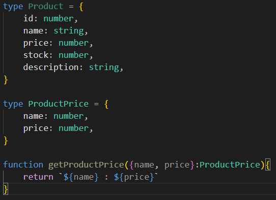
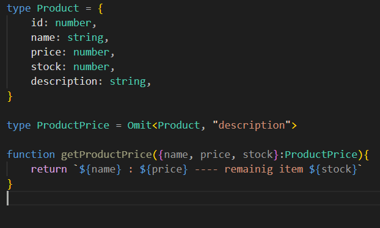

<h1><b>Title:</b></h1>

### How do Pick and Omit utility types prevent code duplication while creating specialized "slices" of a master interface? Discuss how this keeps your code DRY (Don't Repeat Yourself).

<h1><b>Introduction:</b></h1>

### Pick and omit utility types prevent code duplication. This utility implements the DRY concept in the code base.

## DRY
### DRY (Don't Repeat Yourself) a software development principle in the concept of not repeating data and logic.

### In simple terms, one should avoid the same logic multiple times. It should be reusable. If any change is needed, you should change it one time.
>DRY benefits us in many ways like maintainability, readability, reduction in bugs, scalability.

## Pick:
### The pick utility constructs a type rather than creating a new one. This utility picks certain keys and creates a new interface which is dependent on the master interface. If we need to change types we will change in the master interface. Then the change will propagate.

> Don't follow DRY. And repeated code.
 

> Follow DRY concept. clean and don't repeated code

## Omit
### This utility takes all elements from the master interface and deletes specific keys and creates a new interface that depends on the master interface. This is also the same way to change and propagate the pick utility.

> Don't follow DRY. And repeated code.
 

> Follow DRY concept. clean and don't repeated code

<h1><b>Conclusion:</b></h1>
The pick and omit utility prevents us from duplicating data types . it creates a new type without duplicate rather than taking from the master interface.

